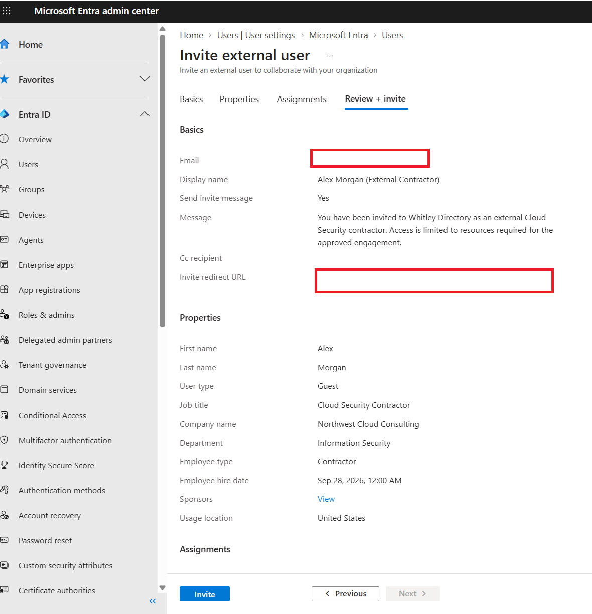
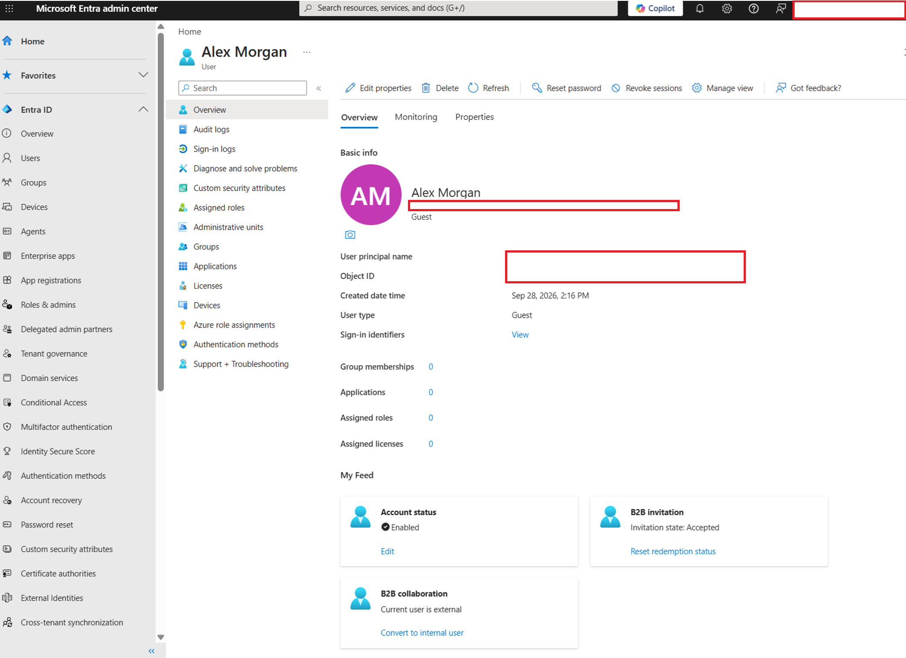
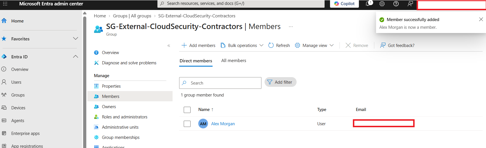
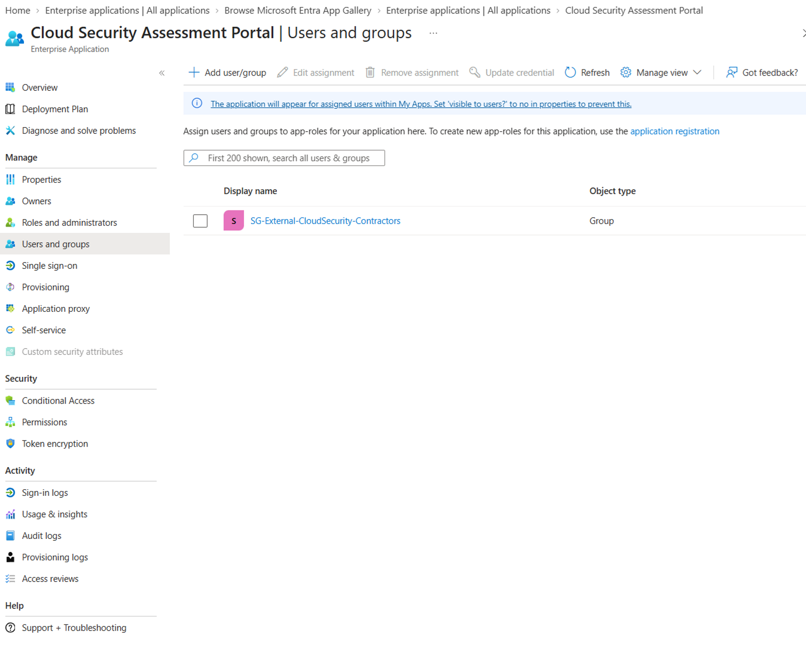
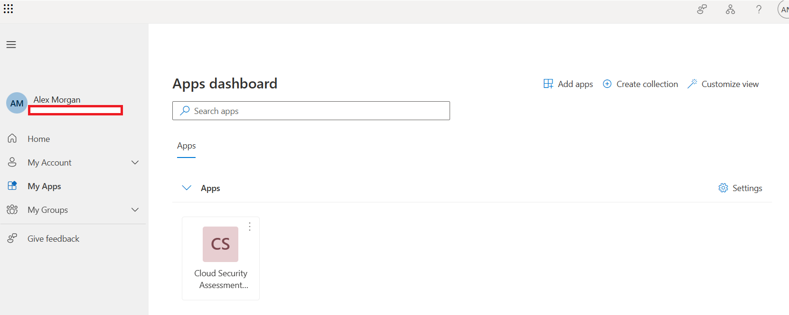
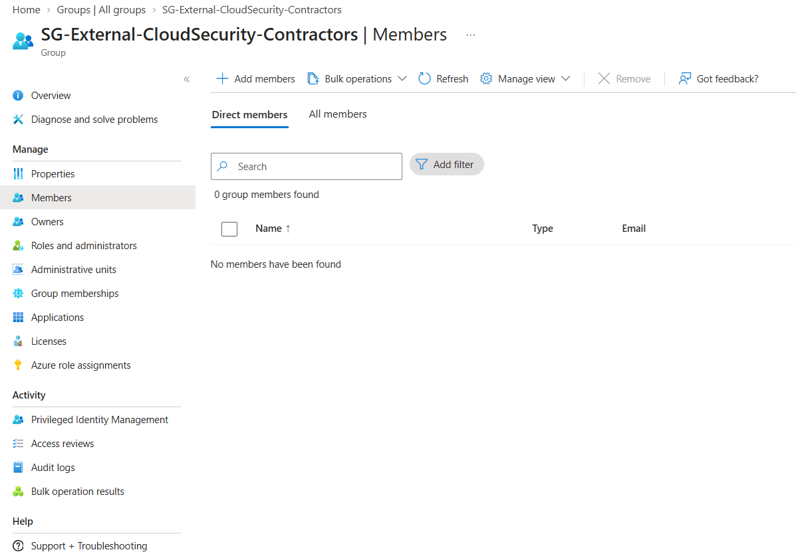
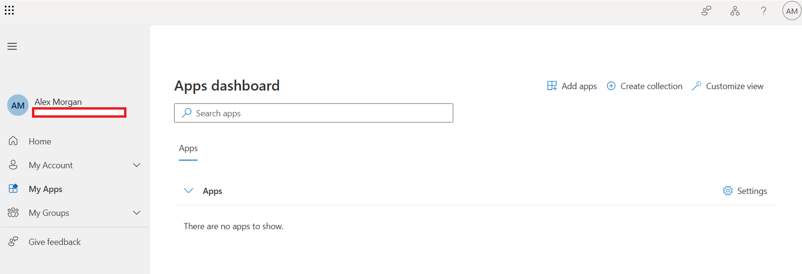
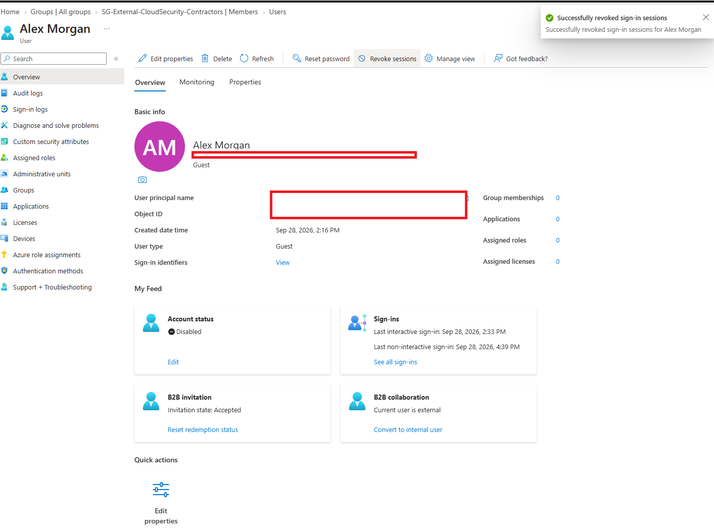

# Microsoft Entra B2B External Contractor Identity Lifecycle

## Overview

This project demonstrates the implementation and validation of a temporary external contractor identity lifecycle using Microsoft Entra ID B2B collaboration.

The objective was to provide an external cloud security contractor with access to a specific enterprise application while applying least-privilege principles and preventing unnecessary access to organizational resources.

Rather than assigning application access directly to the contractor, authorization was managed through a dedicated security group. This created a repeatable access model in which application access could be granted or revoked through group membership.

The lab covers the complete lifecycle from external identity provisioning through access validation and offboarding.

**Identity Lifecycle:**

**Invite → Authenticate → Authorize → Validate → Revoke → Verify → Disable**

---

## Scenario

A fictional organization hired **Alex Morgan**, an external Cloud Security Contractor from **Northwest Cloud Consulting**, for a temporary security assessment.

### Business Requirement

The contractor required access to the organization's **Cloud Security Assessment Portal** but did not require:

- Microsoft Entra administrative privileges
- Access to unrelated enterprise applications
- Membership in internal employee groups
- Persistent access after the engagement ended

The goal was to provide only the access required for the engagement and ensure that access could be reliably removed during offboarding.

---

## Access Architecture

Application authorization was managed through a dedicated security group rather than through direct user assignment.

```text
External Contractor
        ↓
Microsoft Entra B2B Guest
        ↓
SG-External-CloudSecurity-Contractors
        ↓
Cloud Security Assessment Portal
```

This design separates the external identity from the application entitlement.

Instead of managing access individually at the application level, membership in `SG-External-CloudSecurity-Contractors` determines whether the contractor receives access to the Cloud Security Assessment Portal.

This provides a repeatable model for contractor onboarding and offboarding.

---

# Implementation

## 1. External Identity Provisioning

The contractor was invited to the Microsoft Entra tenant using **B2B collaboration**.

The account was configured as a **Guest** identity, distinguishing the external contractor from the organization's internal workforce.



After the invitation was redeemed, the identity was validated in Microsoft Entra ID as an external B2B guest.



This established the contractor identity before application authorization was granted.

---

## 2. Group-Based Authorization

A dedicated security group was created to manage access for external cloud security contractors:

`SG-External-CloudSecurity-Contractors`

Alex Morgan was added to the group rather than being assigned directly to the enterprise application.



The contractor security group was then assigned to the **Cloud Security Assessment Portal** enterprise application.



The resulting authorization path was:

```text
External Identity
      ↓
B2B Guest Account
      ↓
Security Group Membership
      ↓
Enterprise Application Access
```

This design allows application authorization to be controlled through group membership rather than through individual application assignments.

---

## 3. Positive Access Validation

After the authorization configuration was completed, the contractor account was used to validate the expected access.

The **Cloud Security Assessment Portal** appeared in the contractor's Microsoft My Apps portal.



**Test Result: PASS**

The contractor received access to the application while assigned to the authorized security group.

This confirmed that the configured authorization path operated as intended.

---

## 4. Access Revocation

At the end of the simulated contractor engagement, Alex Morgan was removed from:

`SG-External-CloudSecurity-Contractors`

The group was then verified to contain no contractor membership.



Removing the contractor from the authorization group eliminated the group-based entitlement used to provide access to the Cloud Security Assessment Portal.

---

## 5. Negative Access Validation

After the entitlement was removed, the contractor account was used again to verify the resulting access state.

The Cloud Security Assessment Portal was no longer displayed in Microsoft My Apps.



**Test Result: PASS**

The application was no longer available to the contractor after removal from the authorized security group.

Testing both the authorized and revoked states demonstrated that the access control operated in both directions:

```text
Authorized Group Membership
        ↓
Application Available

Group Membership Removed
        ↓
Application No Longer Available
```

---

## 6. Contractor Offboarding

After application access was revoked and validated, the contractor identity was disabled as the final offboarding control.

Active sign-in sessions were also revoked.



The final identity state showed:

- Account disabled
- Zero group memberships
- Zero application assignments
- Zero assigned roles
- Sign-in sessions revoked

This provided an additional identity-level control after the contractor's application entitlement had already been removed.

---

# Validation Summary

| Control | Validation | Result |
|---|---|---|
| External identity provisioned as B2B guest | Guest identity verified in Microsoft Entra ID | PASS |
| Application access managed through security group | Contractor added to dedicated authorization group | PASS |
| Group assigned to enterprise application | Group-to-application assignment verified | PASS |
| Authorized user receives application access | Application visible in contractor My Apps | PASS |
| Group membership can be revoked | Contractor removed from authorization group | PASS |
| Revocation removes application availability | Application no longer visible in contractor My Apps | PASS |
| Contractor identity disabled | Account status verified as disabled | PASS |
| Existing sessions revoked | Session revocation confirmed | PASS |

---

# Security Principles Demonstrated

### Least Privilege

The contractor was provided access to the resource required for the engagement without receiving Microsoft Entra administrative privileges or unrelated application access.

### Group-Based Authorization

Application access was associated with a dedicated security group rather than directly assigned to the contractor identity.

This separates identity provisioning from application entitlement management and provides a repeatable authorization model.

### External Identity Management

Microsoft Entra B2B collaboration was used to represent the contractor as an external Guest identity rather than creating an internal workforce identity.

### Access Validation

The authorization model was tested from the contractor's perspective to confirm that the expected application became available.

### Revocation Validation

Access was tested again after group membership was removed to verify that the application was no longer available.

### Identity Offboarding

After application authorization was removed, the contractor account was disabled and existing sign-in sessions were revoked.

---

# IAM and GRC Perspective

This project demonstrates how identity administration, technical access controls, and control evidence can support the same identity lifecycle.

```text
Business Requirement
        ↓
Identity Provisioning
        ↓
Authorization
        ↓
Access Validation
        ↓
Entitlement Revocation
        ↓
Revocation Validation
        ↓
Account Disablement
```

From an **IAM perspective**, the project demonstrates external identity provisioning, group-based authorization, least privilege, access revocation, and account lifecycle management.

From a **security perspective**, the project validates both authorized and unauthorized states rather than relying solely on administrative configuration.

From a **GRC perspective**, evidence was retained for the major stages of the lifecycle so that the implementation and operation of the access controls could be demonstrated.

---

# Key Takeaways

This project reinforced several practical identity-management concepts:

1. **Identity and entitlement should be managed separately.**  
   The contractor existed as an external identity while application authorization was controlled through security-group membership.

2. **Group-based authorization simplifies access changes.**  
   Application access could be removed by changing group membership without modifying the enterprise application configuration.

3. **Successful configuration should be validated.**  
   Administrative settings alone do not demonstrate the resulting user experience. Testing confirmed that authorized access was available.

4. **Revocation should also be validated.**  
   Removing an entitlement was followed by a negative access test to verify that the application was no longer available.

5. **Offboarding should address both authorization and identity state.**  
   Application entitlement was removed before the external account was disabled and existing sign-in sessions were revoked.

---

## Technologies Used

- Microsoft Entra ID
- Microsoft Entra B2B Collaboration
- Microsoft Entra Security Groups
- Microsoft Entra Enterprise Applications
- Microsoft My Apps

---

## Project Outcome

The lab successfully demonstrated a temporary external contractor identity lifecycle using Microsoft Entra ID.

The contractor was provisioned as an external B2B guest, authorized through group membership, validated for appropriate application access, removed from the authorization group, tested to confirm access removal, and subsequently disabled with existing sign-in sessions revoked.

The resulting implementation demonstrates a repeatable approach to **external identity lifecycle management, least-privilege authorization, access validation, and contractor offboarding**.
